# 🏡 Cottage Booking App

This document presents an overview of the **Cottage Booking App** through screenshots.  
The interface is shown from the perspectives of an **Unregistered User**, **Tourist**, **Cottage Owner**, and **Administrator**.

## 🧰 Technologies Used

| Layer | Technology |
|--------|-------------|
| Frontend | **Angular**, **TypeScript**, **Tailwind CSS**, **ng2-charts**, **FullCalendar** |
| Backend | **Node.js**, **Express.js**, **Mongoose**, **Multer**, **bcrypt** |
| Database | **MongoDB** |

---
## 🔓 Unregistered User

  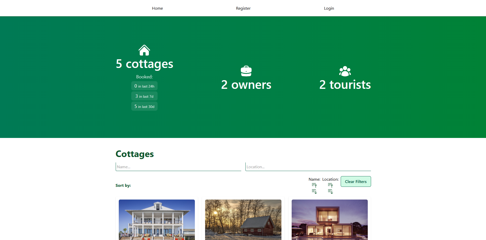

  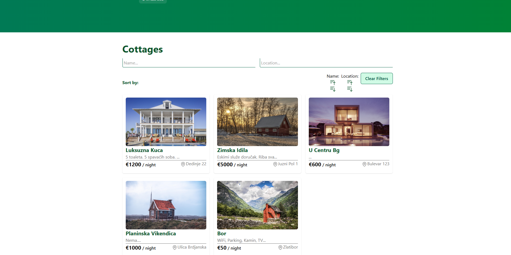

---

## 🔐 Authentication

  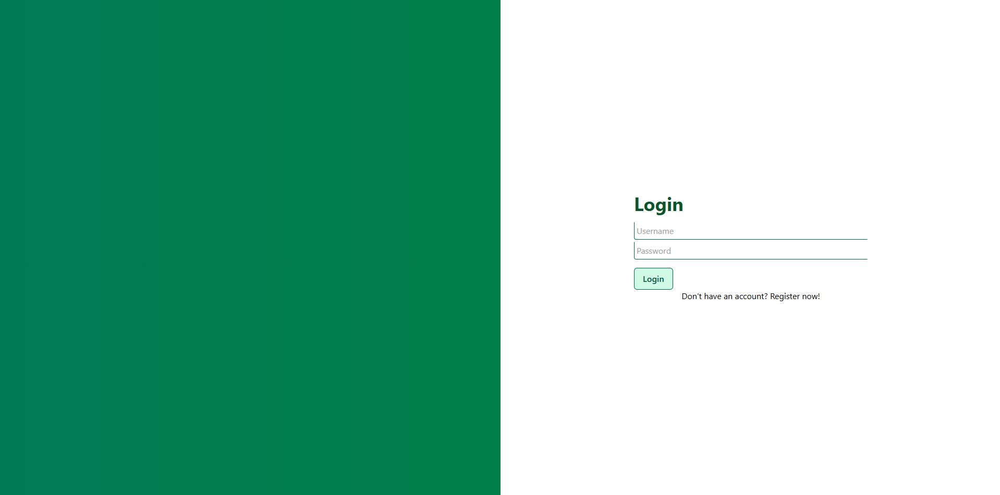

  

  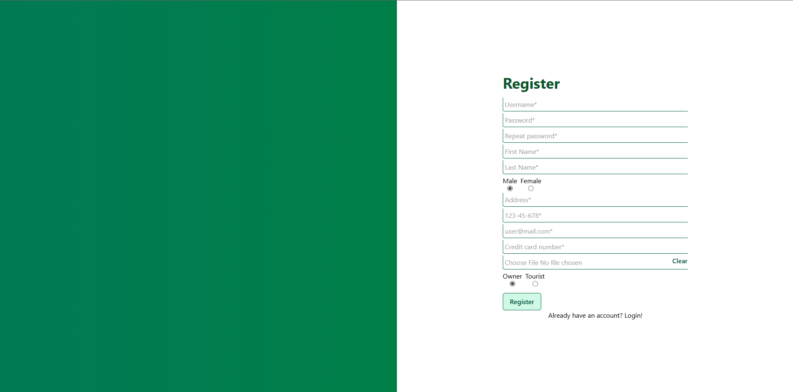

  

---

## 🧑‍💼 Cottage Owner

### 📋 Cottages

  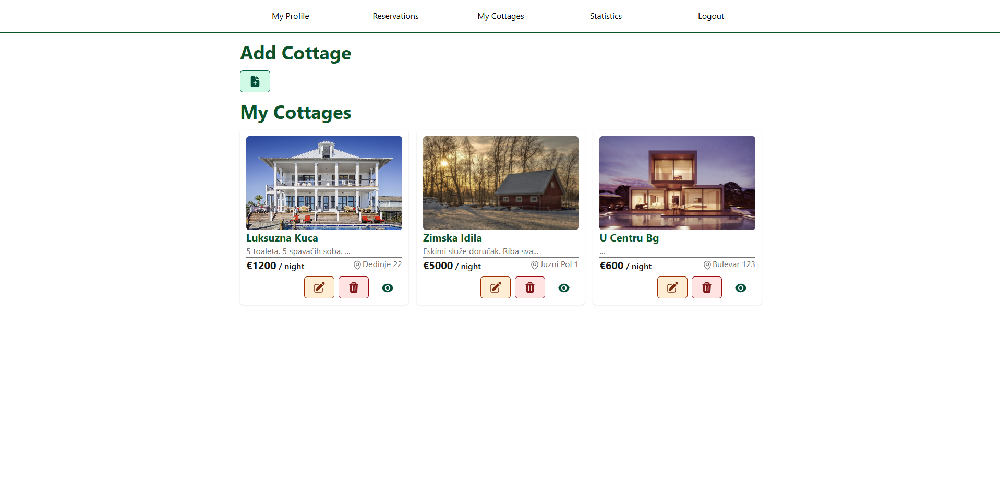

### 📅 Reservations

  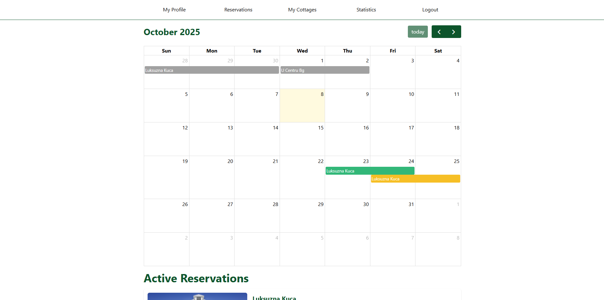

  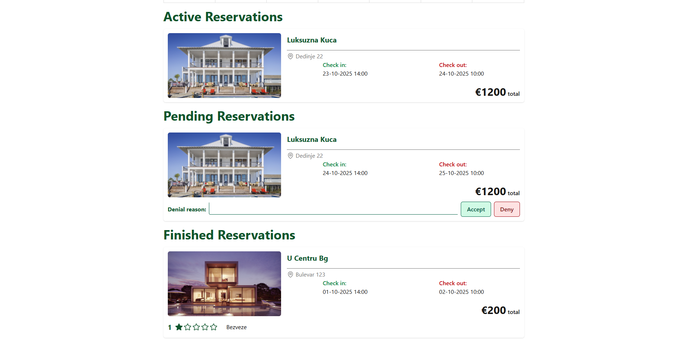

### 📊 Statistics

  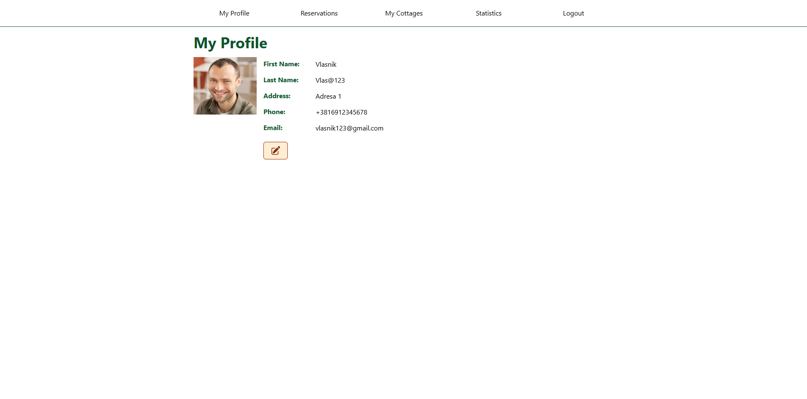

---

## 🧳 Tourist

### 🏡 Cottage Overview

  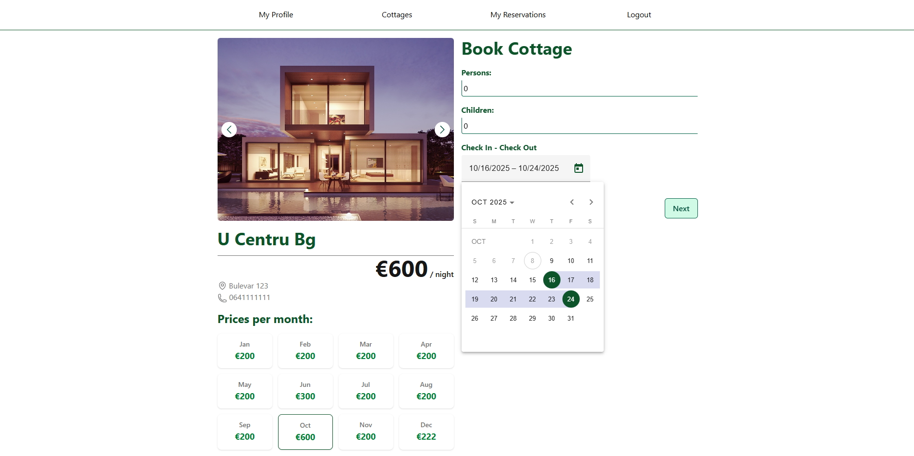

  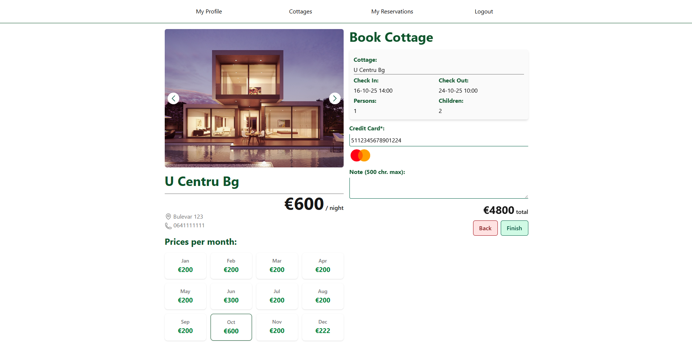

  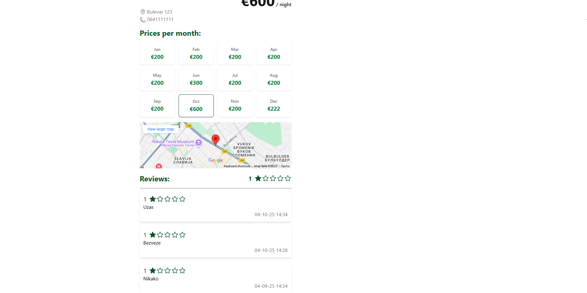

### 📆 Reservations

  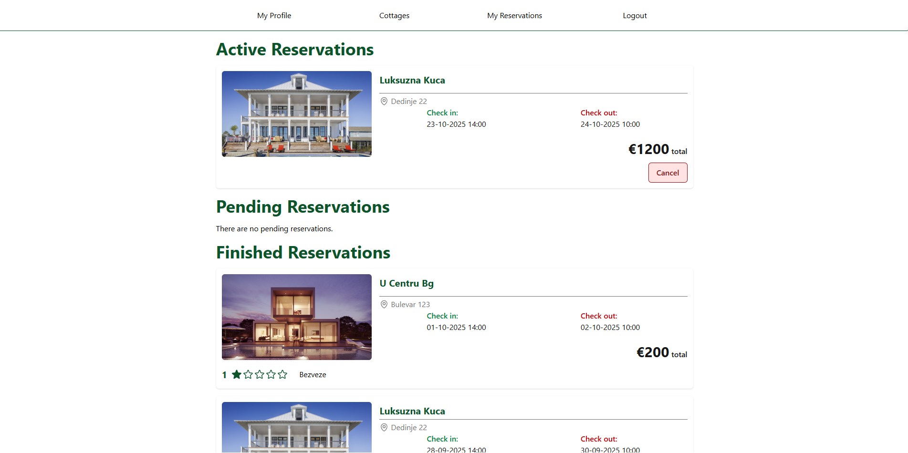

---

## 🛠️ Administrator

  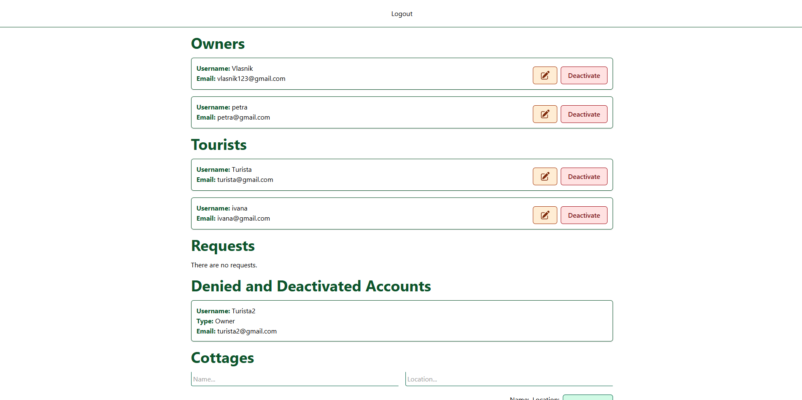

  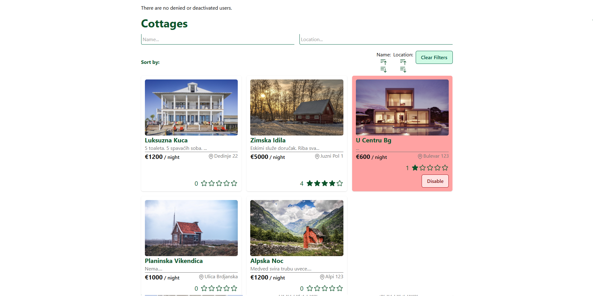

---

📸 *All screenshots were taken from the local version of the application.*
